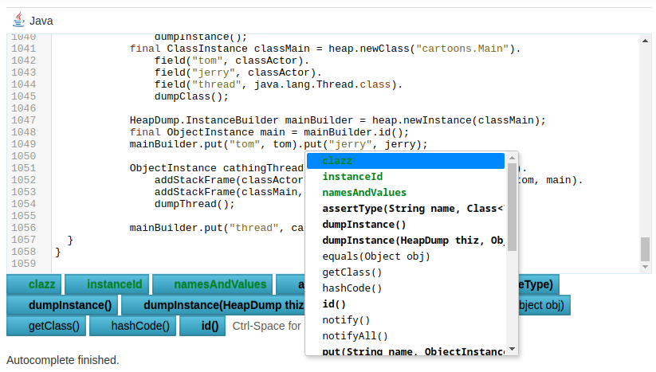

# GraalVM Code Online

_For release in November 2021_

To celebrate success of Lukáš Rozsypal internship, OracleLabs is proud to announce the
immediate availability of _GraalVM Code Online_ - a lightweight, yet feature
rich online __Java__ code editing environment. _GraalVM Code Online_ is an 
instantly available add-on for any Java documentation web site with ability 
to provide interactive code snippets, easy to explore tutorials and
interactive _try and see_ experience.

## Live Code Snippets for Java Documentation

Ever saw non-compilable, outdated, hard to read code snippets provided
without any connection to the rest of the documentation? Say farewell
to such ancient style of documentation and spice your code snippets
with real IDE-like feel provided to adopters of your technology instantly,
without having to leave their browser!

Your documentation is no longer going to be just a static listing of
classes and methods and few samples spread in between. Rather than that 
your documentation will become an interactive
portal with a playground allowing currious visitors to start exploring
ready made samples and naturally expand their knowledge horizon step
by step while having full comfort of documentation cross-linked with
live code editor directly in their browser.

## aot.js

The overall experience of _GraalVM Code Online_ is built on mature and
rock solid GraalVM _ahead of time compilation_ technology with a revolutionary 
JavaScript compiler backend - in short the __aot.js__ compiler.

The __aot.js__ compiler brings the power of _Java back to browser_ where 
the story of Java has begun! It does so by processing the bytecode of any Java application and emitting 
appropriate JavaScript constructs. This transpilation is
not only effective, but also very powerful. A wide list of popular
Java libraries is ready to be transpiled into JavaScript and executed in the browser.

The power of __aot.js__ is greatly demonstrated by transpiling `javac` -
the official Java compiler and using it as the backend for 
_GraalVM Code Online_. As soon as the documentation page is loaded
it starts behind the scene initialization of code editing infrastructure
built on top of the `javac`. The sample code as well as 
modifications made to it by the user are processed by real `javac`
compiler providing _WYSIWYG_ experience - hints, completions, errors
are exactly the same as when using `javac` on command line or in a real
desktop IDE.

## JavaScript Libraries at Your Hand

Indeed, the __Java__ runtime in the browser is slightly _different_ to the regular
__Java__ execution environments on desktop or server. It makes no sense to
bring Swing, JSON parser, file access or networking stack with you. All of
that has already been provided by the browser and various JavaScript libraries!
Rather than duplicating such functionality the __aot.js__ provides rich and
powerful integration with such libraries. 

_GraalVM Code Online_ builds on top that and uses modern __React.js__
based UI to render the editor and surrounding control buttons. By providing
a reusable web component, it makes it easy to import and include
the `javac` infrastructure as well as the associted user interface into any
HTML page and tailor every aspect of the component presentation to fully meet
the expected user experience.

## Enrich Your Project Documentation

Frameworks like __Micronaut__ or __GraalVM__ are encouraged to reuse the _GraalVM Online Code_
component and incorporate it into their websites. All that is needed is to 
prepare a sample project (Maven or Gradle) and use a special
__plugin__ to process the libraries as well as sample sources 
into an embeddable website component packaged in a ZIP file.

The generated ZIP file is going to contain fully encapsulated _GraalVM Online Code_ 
execution environment including the transpiled `javac` compiler (combined together
with necessary annotation processors used by the sample project) ready to
analyse the sample source, report errors, provide completions, hints,
references to other documentation, etc.

Using such system is a matter of expanding the static files, including them
from the HTML pages and placing the editing component at appropriate location.
No need to setup a remote coding server - everything is going to be handled
automatically in the client browser - cost saving on the infrastucture
commonly required to provide such _try & play_ endeavours.

## Graduating from the Playground 

The goal of _GraalVM Online Code_ is to let currious users explore the
technology, get started very quickly without any complicated setup. However,
regular day to day development isn't happening in a browser, but in desktop IDEs
with source code hosted in Git repositories.

As such the _GraalVM Online Code_ systems offers an easy way to graduate from the
playground. E.g. to download the project with all the modifications from the
browser and expand it on the local disk to let it be opened by regular development tools like
_VSCode_ with _GraalVM extensions_.

# Summary

__Java__ has just returned back to browser. It can be transpiled and executed
in there with the help of __aot.js__ compiler. Thanks to _GraalVM Online Code_
component it can even be developed without leaving browser. Join us in celebrating such an
important milestone and help us __run Java everywhere__. Spice your documentation
with _GraalVM Online Code_ component!

